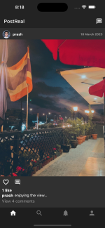
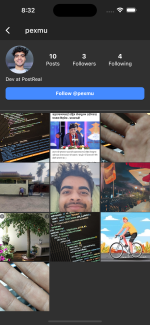
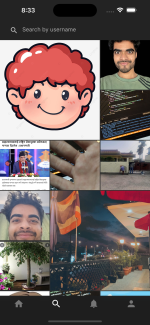
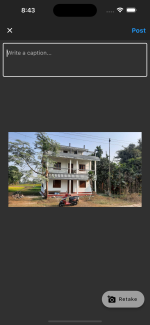

### Post Real, a social media app

Social media app that only allows you to post photos from your camera, not from gallery, to encourage real-time and authentic sharing.

##### Screenshots:

    

##### Features:

- Post picture from camera
- Like/Comment on Posts
- Get connected with other users

##### Tasks more to do:

- Add more features like notification, navigation
- Optimize code, refactor, implement local storage caching
- Publish to Google Play Store
- Your PR's or any form of contribution will be acknowledged.
- For any purpose: hi@ghimireprashant.com.np

##### Integrated Services:

- Firebase Authentication, Firestore, Storage

##### Used State Management:

- Flutter Bloc

##### Configs before running the app:

android, ios, web, windows, macos directories are git ignored. So you need to create them like shown below:

- First be inside project directory (postreal)
- Run below commands
  ```
  # to create ios directory
  flutter create -i swift .
  # to create android directory
  flutter create -a kotlin .
  ```
- If you are going to run in ios, you need to specify camera and photo library permission to Info.plist file.
- Info.plist is located at ios/Runner/Info.plist
- Below is the key/string values that you need to add within the 'dict' tag of Info.plist file
  ```
  <key>NSPhotoLibraryUsageDescription</key>
  <string>Photo Library Usage</string>
  <key>NSCameraUsageDescription</key>
  <string>Camera Usage</string>
  <key>NSMicrophoneUsageDescription</key>
  <string>Microphone Usage</string>
  ```
- Now after specifying ios permission requirements, you need to configure Firebase to this project.
- Add your own firebase_options.dart file which consists of your Firebase keys and configs inside lib directory. You can do this step by reading any docs of configuring Firebase with Flutter.
- For ios, you also need GoogleService-Info.plist file. You can get this file from Firebase Console inside ios app section.
- After getting GoogleService-Info.plist file, Open ios directory in Xcode, now add this file to Runner/Runner directory.
- After setting your own Firebase, now you need to update the app bundle id of this app. Match same bundle id for this app and what you kept during Firebase configuration.
- Add google-services.json file that you download from Firebase Console to android/app directory.
- For android, add the Firebase SDK dependencies in the Project Level build.gradle file (android/build.gradle). Add below line in dependencies{} section
  ```
  classpath 'com.google.gms:google-services:4.3.10'
  ```
- Now you need to specify Google Services plugin in App Level build.gradle file (android/app/build.grade), to do it add below line
  ```
  apply plugin: 'com.google.gms.google-services'
  ```
- You also need to set minSdkVersion to 19 and enable multidex to true like shown below in the defaultConfig{} section

  ```
  minSdkVersion 19
  multiDexEnabled true
  ```

- Now you are ready to run the app.
